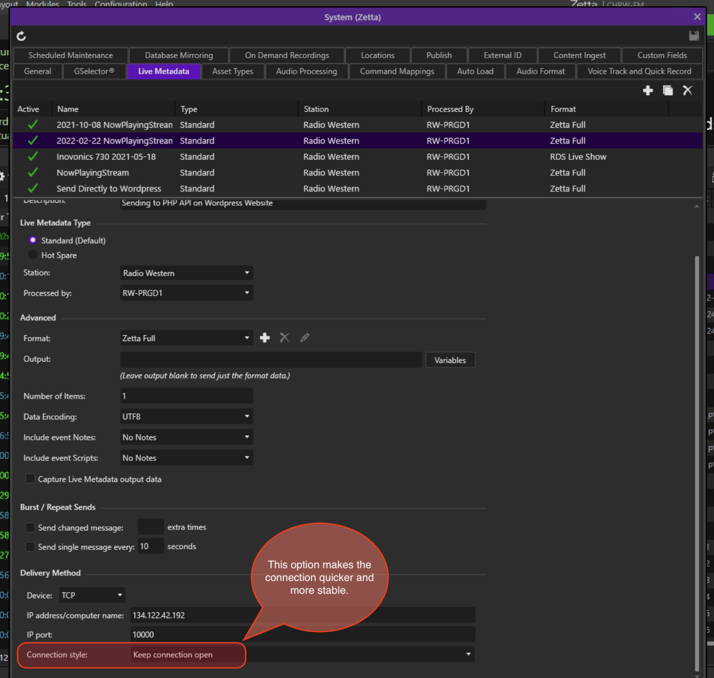

# ZettaLogger.php

## NGINX configuration for connecting outside world to TCP socket-server via Nginx (and also for logging)
1. `$sudo mkdir -pv /var/log/nginx/zetta_logger/`
2. `$sudo nano /etc/nginx/customAPI/zetta_logger`
```
stream{
    log_format custom_log_format '$remote_addr [$time_local] $status ';

    upstream php_socket_zettalogger{
      server 0.0.0.0:10001 max_fails=3 fail_timeout=30s;
    }

    server {
      listen 10000;
      proxy_pass php_socket_zettalogger;

      access_log /var/log/nginx/zetta_logger/access.log custom_log_format;
      error_log /var/log/nginx/zetta_logger/error.log;

    }
}

```

## Systemd Service to auto-start the TCP socket-server
`$sudo nano /etc/systemd/system/zetta_logger.service` 
```
[Unit]
Description=Zetta Listener Server
After=mysql.service
StartLimitIntervalSec=0
[Service]
User=www-data
Group=www-data
WorkingDirectory=/var/www/customAPIs/zetta_logger
Type=simple
PIDFile=/run/zetta_logger.pid
ExecStart=/usr/bin/php /var/www/customAPIs/zetta_logger/index.php
StandardOutput=file:/var/www/customAPIs/zetta_logger/stdout.txt
StandardError=file:/var/www/customAPIs/zetta_logger/stderr.txt
KillMode=process

Restart=always
RestartSec=1

[Install]
WantedBy=default.target
```


## Improvements Desired

1. Must improve the REGEX. It does not match the following for example
```
<?xml version="1.0" encoding="utf-8"?>
<ZettaClipboard Version="0.0.0" MessageType="0">
  <Station StationID="1" Name="Radio Western" Active="true" Comment="Radio Western 94.9 FM Broadcast" StationRole="PRIMARY" UniversalIdentifier="6d8a0ad7-93f0-4c87-b8e0>
  <LogEvents>
    <LogEvent UniversalIdentifier="cbc1e7ed-8b39-ed11-9026-dfd61a1620b1" LogEventID="568701" LogGroupID="25351" Sequence="9" LogEventEntryTypeID="106" Description="Musi>
      <LogGroup LogGroupID="25351" LogGroupTypeID="101" LogID="1311" Sequence="15" Hour="15"><?xml version="1.0" encoding="utf-8"?>
<ZettaClipboard Version="0.0.0" MessageType="0">
  <Station StationID="1" Name="Radio Western" Active="true" Comment="Radio Western 94.9 FM Broadcast" StationRole="PRIMARY" UniversalIdentifier="6d8a0ad7-93f0-4c87-b8e0>
  <LogEvents>
    <LogEvent UniversalIdentifier="cbc1e7ed-8b39-ed11-9026-dfd61a1620b1" LogEventID="568701" LogGroupID="25351" Sequence="9" LogEventEntryTypeID="106" Description="Musi>
      <LogGroup LogGroupID="25351" LogGroupTypeID="101" LogID="1311" Sequence="15" Hour="15">
        <LogHeader LogID="1311" LogTypeID="0" Date="2022-09-22T00:00:00.0000000-04:00" />
      </LogGroup>
      <AssetEvent>
        <Asset AssetID="55658" AssetTypeID="3" Title="Music Is The Medicine Promo" AssetTypeName="Link" PrimaryResourceID="58379" Comment="KCrawford, ERae, 2022" infoCr>
          <Resource ResourceID="58379" ResourceTypeID="1" ResourceFile="\\RW-ONAR1\Zetta\Media\58\58379~RW Show Promos - 2022-02-28 - Music Is The Medicine.m4a" Length=>
            <Transition ResourceLength="30.4298" Filename="58379~RW Show Promos - 2022-02-28 - Music Is The Medicine.m4a" PlaybackMode="OnAir" FileMD5="7DD6E40DEADB8CC4>
              <PointOfInterestMarker Position="0" Enabled="true" Duration="0.1599" Value="0" Details="" POIType="13" />
              <PointOfInterestMarker Position="29.9856" Enabled="true" Duration="0" Value="0.4442" Details="" POIType="8" />
              <VolumeMarker Position="0" Level="1" />
              <VolumeMarker Position="30.4298" Level="1" />
            </Transition>
          </Resource>
          <Artist ArtistID="3364" ArtistTypeID="0" Name="RW Show Promos" />
          <Album AlbumID="4687" Name="Music Is The Medicine" />
          <Product ProductID="2336" Name="Music Is The Medicine" />
          <Sponsor SponsorID="750" Name="RW Show Promos" />
          <AssetAttribute AttributeTypeID="10004" AttributeTypeName="Genre" AttributeValueName="RW Promos" />
          <AssetAttribute AttributeTypeID="10003" AttributeTypeName="RW Release Date" AttributeValueName="2022-02-28" />
          <StationSpecific StationSpecificId="90981" UniversalIdentifier="d1750455-9dc8-4485-9195-98ecbd3488f2" IsActive="true" Station="Radio Western" StationID="1" St>
            <Category CategoryID="32" Name="Pm" AssetTypeID="3" CategoryGroup="10 Promos" LongName="Promos" />
          </StationSpecific>
        </Asset>
      </AssetEvent>
    </LogEvent>
  </LogEvents>
</ZettaClipboard>
```

## Zetta Configuration


